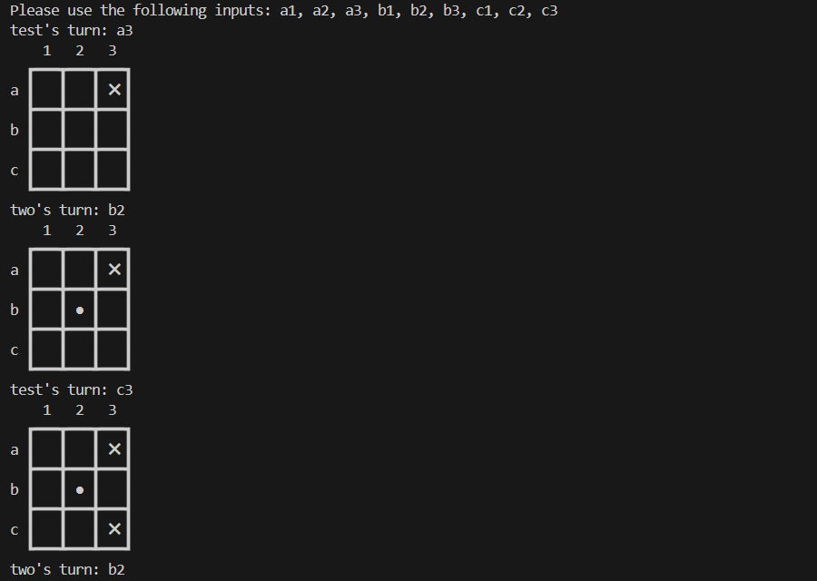

# Tic Tac Toe (Ruby)

A command-line Tic Tac Toe game written in Ruby. This project is part of [The Odin Project](https://www.theodinproject.com/lessons/ruby-tic-tac-toe) curriculum.

## Description

This is a simple Tic Tac Toe game implemented in Ruby. It allows two players to play the classic game on the command-line interface.

## Features

- Two players can play against each other.
- The game displays the board after each move.
- It validates and handles invalid moves.
- It checks for a winner or a draw and declares the result.
- Option to fight AI (WIP)

## Installation

### Windows

1. Ensure you have Ruby installed. If not, download and install it from [here](https://www.ruby-lang.org/en/downloads/).
2. Clone this repository to your local machine.
    ```bash
        git clone git@github.com:PeterG-ithub/ruby-tictactoe.git
3. Navigate to the directory where you cloned the repository.
    ```bash
        cd tic-tac-toe
4. Run main.rb to start the game.
    ```bash
        ruby main.rb

### Linux

1. Open a terminal.
2. Ensure you have Ruby installed by running `ruby --version`. 
    ```bash
        ruby --version

If not, install Ruby using your package manager.

        sudo apt update
        sudo apt-get install ruby-full

3. Clone this repository to your local machine.
    ```bash
        git clone git@github.com:PeterG-ithub/ruby-tictactoe.git
4. Navigate to the directory where you cloned the repository.
    ```bash
        cd tic-tac-toe
5. Run main.rb to start the game.
    ```bash
        ruby main.rb

## Credits

These Ruby practice exercises are part of the curriculum provided by The Odin Project, an open-source online platform that offers free resources to learn web development.
- Website: [The Odin Project](https://www.theodinproject.com/)
- Ruby Course: [Ruby](https://www.theodinproject.com/paths/full-stack-ruby-on-rails/courses/ruby)
- TicTacToe lesson: [TicTacToe](https://www.theodinproject.com/lessons/ruby-tic-tac-toe)

## Screenshot demo


